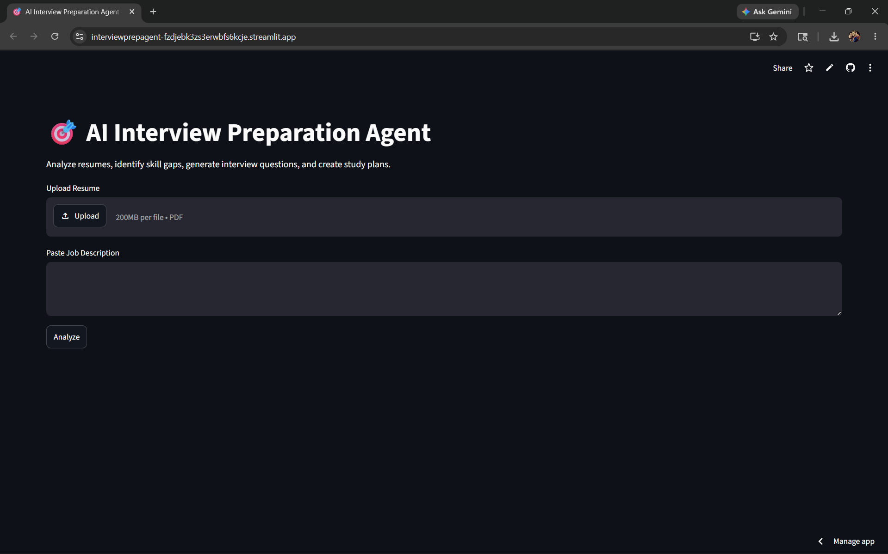
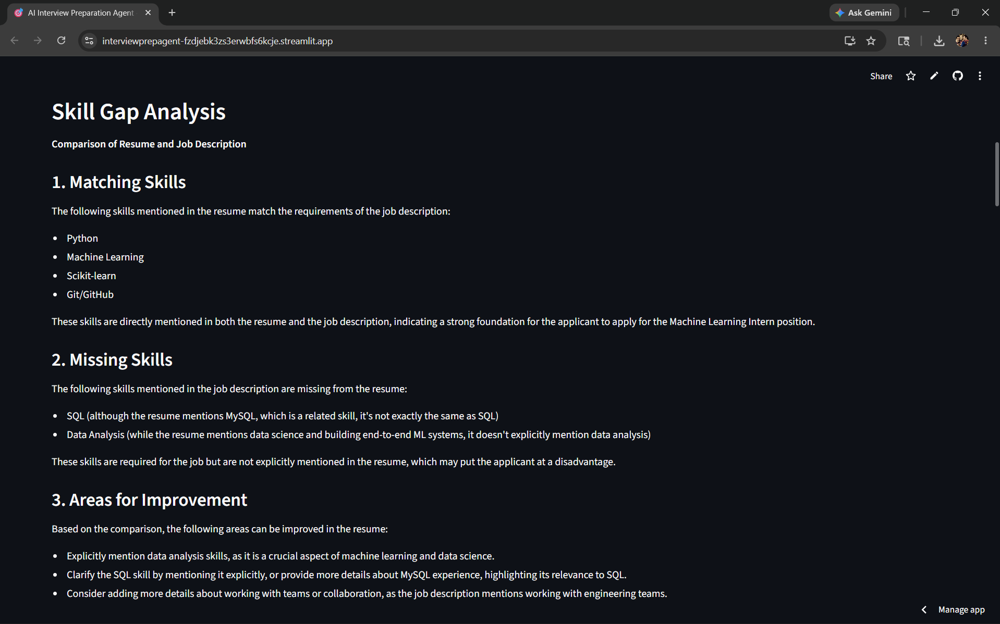
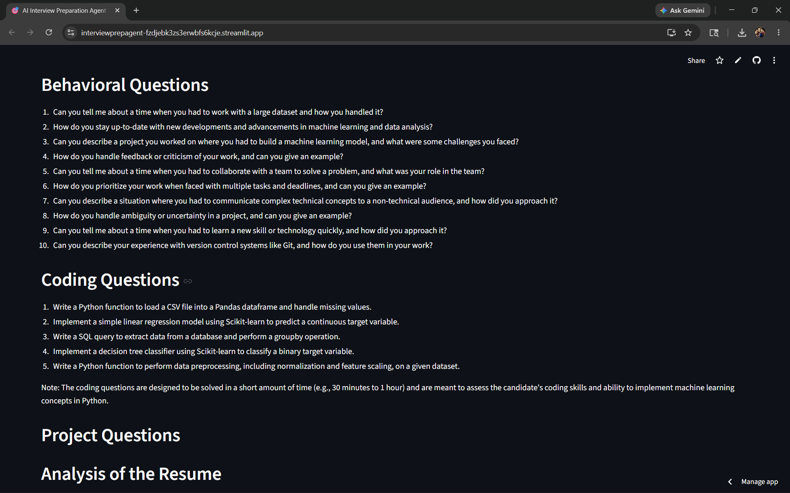

# AI Interview Preparation Agent

## Overview

AI Interview Preparation Agent is an intelligent assistant that helps candidates prepare for interviews by automatically analyzing job descriptions and resumes. The agent identifies required skills, detects skill gaps, generates personalized interview questions, and creates a structured study plan.

This project was built to simplify interview preparation and reduce the manual effort required to understand job requirements and prepare effectively.

---

## Problem Statement

Preparing for technical interviews is often time-consuming and repetitive. Candidates must:

* Analyze job descriptions manually
* Identify important skills
* Compare requirements with their resume
* Find relevant interview questions
* Create a study plan

This process can take hours for every application.

---

## Solution

The AI Interview Preparation Agent automates the entire workflow by:

1. Analyzing a job description
2. Extracting key skills and requirements
3. Parsing the candidate's resume
4. Performing skill-gap analysis
5. Generating interview questions
6. Creating a personalized preparation roadmap

---

## Features

### Job Description Analysis

* Extracts required skills
* Identifies experience level
* Highlights key responsibilities

### Resume Analysis

* Reads PDF resumes
* Extracts project and skill information

### Skill Gap Detection

* Compares resume skills against job requirements
* Identifies missing skills
* Suggests improvement areas

### Interview Question Generation

* Technical questions
* Behavioral questions
* Coding questions

### Project-Based Questions

Generates personalized questions based on projects listed in the resume.

Examples:

* Why did you choose cosine similarity for your recommender system?
* Why was Linear Regression selected for CLV prediction?
* Explain the architecture of AutoStream Agent.

### Study Plan Generator

Creates a structured 7-day preparation roadmap tailored to the job description.

---

## Architecture

```text
                 User
                   │
                   ▼
      Resume + Job Description
                   │
                   ▼
            Resume Parser
                   │
                   ▼
             Groq LLM API
                   │
      ┌────────────┼────────────┐
      ▼            ▼            ▼
 JD Analysis  Skill Gap   Question Generator
                              │
                              ▼
                      Study Planner
                              │
                              ▼
                       Streamlit UI
```

## Tech Stack

### Frontend

* Streamlit

### Backend

* Python

### AI Model

* Groq API
* Llama 3.3 70B Versatile

### Libraries

* pdfplumber
* python-dotenv

---

## Project Structure

```text
InterviewPrepAgent/
│
├── app.py
├── requirements.txt
├── README.md
│
├── agents/
│   ├── resume_parser.py
│   ├── jd_analyzer.py
│   ├── question_generator.py
│   ├── skill_gap.py
│   └── study_planner.py
│
├── utils/
│   └── llm.py
│
└── data/
```

---

## Installation

Clone the repository:

```bash
git clone https://github.com/yourusername/InterviewPrepAgent.git
cd InterviewPrepAgent
```

Install dependencies:

```bash
pip install -r requirements.txt
```

Create a `.env` file:

```env
GROQ_API_KEY=your_api_key_here
```

Run the application:

```bash
streamlit run app.py
```

---

## Usage

1. Upload a PDF resume
2. Paste a job description
3. Click **Analyze**
4. Review:

   * Job Description Analysis
   * Skill Gap Analysis
   * Interview Questions
   * Project Questions
   * Study Plan

---

## Example Workflow

Input:

* Resume PDF
* Machine Learning Internship Job Description

Output:

* Extracted required skills
* Missing skill recommendations
* Personalized interview questions
* Project-specific discussion questions
* 7-day study roadmap

---

## Future Improvements

* Resume scoring system
* ATS compatibility analysis
* Interview difficulty prediction
* Mock interview mode
* Voice-based interview practice
* Multi-agent architecture

---

## Impact

The agent helps candidates:

* Save preparation time
* Understand job requirements faster
* Focus on missing skills
* Practice targeted interview questions
* Prepare more effectively

---

## Screenshots

### Home Screen


### Skill Gap Analysis


### Results


## Demo

Add:

* https://interviewprepagent-fzdjebk3zs3erwbfs6kcje.streamlit.app/
* https://drive.google.com/drive/folders/1YLd4u_XkBqnM8fNEL1oRq1vPPDRlCTNg?usp=drive_link

---

## Author

Harshul Dashora

B.Tech Computer Science Engineering

GitHub: https://github.com/harshuldashora